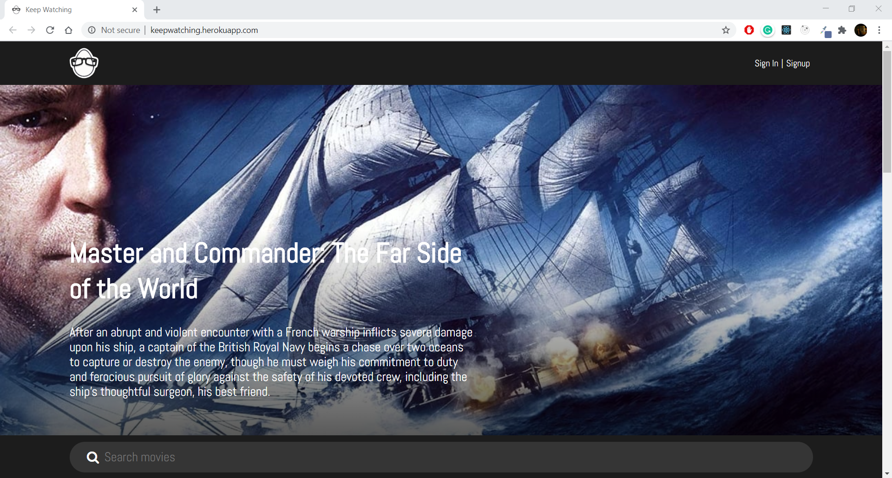

# Keep-Watching
Keep-Watching is a movie recommendation and review app build using React for the front-end, express for the back-end, 
flask for handelling the recommendations and similar movies section, mongoDB for the database 
### Here is the final website : https://keepwatching.herokuapp.com/

### Here is the flask server  https://github.com/yashodeepchikte/Keep-Watching-server

This project uses SurpriseLib for dealing with Cosine similarity based nearest neighbours algorithm for generating recommendations.  
For implimentation purpose dummy users are created using moviewlens 100K dataset. Each user has at least 20 movie ratings. 

 
 

# Features
<ul>
<li>

Recommendations are based on similar users(UserBased Collaborative Filtering) and similar movies (itemBased colaborative filtering)
 (in deployment the item based model exceeds the available memory limit on the free tier of Heroku do this has not been included)
 
 
 

</li>
<li>
signin/sugnup with email  
Signin in with Google Signin with Github (not added to the deployed build yet)
 

   
 
</li>
<li>
Follow users to see their activity in your Feed 

  

</li>
<li>
Search Movies and See their description, imdb ratings, budget, Earnings, director, cast etc.

   

  

</li>
<li>
Add Movies to WishList
</li>
<li>
Admin View
</li>
<li>
User activity page
</li>

</ul>

# Setup And Usage
Clone the repo or download and unzip it  
Use command propmt to navigate to the extracted folder 
Run  
<code> npm install </code> 
navigate to the Client folder and run  
<code> npm install </code>  

For Developement  

#### For deployment npm was used so avoid using yarn to avooid the .loc file conflicts in deployment

in the root folder 
<code>
// in  the root folder in the cmd run  
npm run dev    // this will run both the client and the server in the same command prompt
</code>  
Otherwise to run the client and server seperately  
in the root folder run 
<code>nodemon server.js</code> 
in another command prompt in the client folder run 
<code>npm start </code> 

# Login Credentials
<ul>
<li>
you can login with your Google or GitHub account
</li>
<li>
you can Sign up using any valid email (dosent have to be a valid email)
</li>
<li>
you can use this dummy user 
email : keepwatching@gmail.com  
Password : 123456
</li>
</ul>

